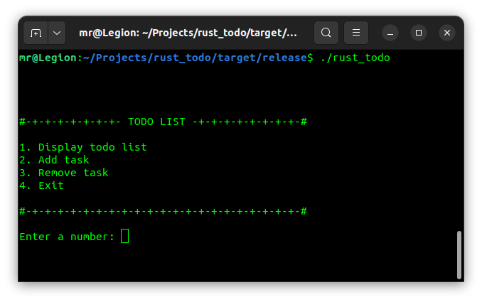

# Todo-list with Rust lang

Just a simple todo list with Rust language...

* "main.rs" is responsible for running functions based on user's input.
* "input.rs" is responsible for handling user's inputs.
* "file.rs" is responsible for handling data management in a text file.
* "display.rs" is responsible for displaying a user interface.

Hope this helps. 💫